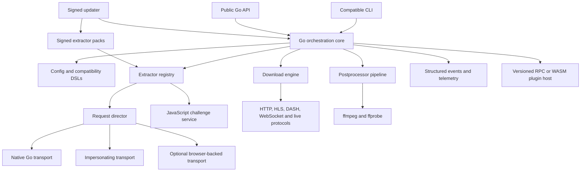

# Zero-Python yt-dlp Go Port Plan

Status: Draft  
Date: 2026-07-17  
Related assessment: [GO_PORT_EVALUATION.md](./GO_PORT_EVALUATION.md)  
Initial reference: [`yt-dlp/yt-dlp@aefce1ee`](https://github.com/yt-dlp/yt-dlp/tree/aefce1eea4d0b6bab1ec2bd3beff09bff91a39c8)

## 1. Objective

Build a native Go implementation that can achieve the same user-visible capabilities as yt-dlp while requiring no Python interpreter, Python library, Python helper process, or Python plugin in its completed form.

The implementation may replace Python-specific APIs and dependencies with different mechanisms, provided the replacements offer equivalent or better capabilities.

The program is complete only when:

- All in-scope built-in yt-dlp capabilities have native or language-neutral replacements.
- Every built-in extractor has an equivalent implementation and documented status.
- User-facing compatibility commitments pass the parity suite.
- No runtime, distribution, build, release, CI, or plugin path requires Python.
- The project can maintain site compatibility at an acceptable ongoing patch rate.

## 2. Definitions

### Capability Parity

Anything a user can accomplish with the reference yt-dlp project can be accomplished with the Go implementation, even when the API, internal design, plugin ABI, or dependency differs.

Capability parity does not require:

- Python source compatibility.
- Import compatibility with `yt_dlp`.
- Existing Python plugins to execute unchanged.
- Identical internal algorithms.
- Byte-identical logs or media files when the semantic result is equivalent.

### Compatibility Parity

Compatibility parity covers persisted user workflows that should migrate without needless breakage:

- CLI options and aliases.
- Configuration discovery and precedence.
- Output-template and format-selection expressions.
- Info JSON and download archives.
- Cache and cookie-file formats where practical.
- Filenames, exit codes, stream selection, and filesystem effects.

Exact compatibility commitments must be declared per feature in the parity manifest rather than assumed globally.

### Zero Python

Zero Python means:

- No Python executable or embedded interpreter.
- No `libpython`, wheel, Python package, or required `.py` asset.
- No helper command that invokes Python indirectly.
- No production fallback to the reference Python implementation.
- No build, packaging, signing, updater, or release job requiring Python.
- No CI or test job requiring Python after the oracle-retirement milestone.

During migration, Python may run only in a quarantined conformance environment as a temporary behavioral oracle. It must never become part of the production architecture.

## 3. Scope

### Included

1. URL routing and all built-in extractor capabilities.
2. Video, audio, playlist, search, channel, comment, subtitle, thumbnail, and metadata extraction.
3. Live, scheduled, rolling, and fragmented media.
4. Authentication, cookies, browser-cookie extraction, proxies, geo-routing, client certificates, and request impersonation.
5. HTTP, HTTPS, FTP, HLS, DASH, WebSocket, RTMP, ISM, F4M, and external downloader integration where supported by the reference.
6. Format filtering, sorting, selection, output templates, metadata parsing, download ranges, retries, resume, archive behavior, and rate controls.
7. ffmpeg/ffprobe orchestration, chapters, SponsorBlock, remuxing, conversion, metadata, subtitles, and thumbnails.
8. A Go library API with structured progress, errors, hooks, cancellation, and streaming results.
9. A replacement extension system for extractors, postprocessors, transports, credential sources, challenge providers, and token/cache providers.
10. Self-update, signed artifacts, reproducible builds, and the supported Windows, macOS, Linux, architecture, and libc matrix.

### Explicit Non-Goals

- Reimplementing ffmpeg codecs or container tooling in Go.
- Preserving the Python import API.
- Loading arbitrary legacy Python plugins in the final product.
- Bypassing DRM or expanding beyond the reference project's legal and safety boundaries.
- Guaranteeing that externally changing websites are always functional; parity is measured against the same reference conditions.
- Optimizing every subsystem before parity is established.

## 4. Guiding Principles

1. **Library first:** the CLI, service integrations, and plugins build on one stable Go API.
2. **No permanent bridge:** every fallback is temporary, measured, owned, and scheduled for removal.
3. **Behavior before cleanup:** match observable behavior before redesigning or optimizing it.
4. **Explicit compatibility:** preserve user data and workflows deliberately, not accidentally.
5. **Pluggable transports:** ordinary HTTP and browser-impersonating traffic have different requirements.
6. **Streaming by default:** playlists, fragments, comments, and progress should not require full materialization.
7. **Bounded execution:** regex, plugins, JavaScript, downloads, and retries receive time, memory, and concurrency limits.
8. **Independent updates:** site logic must be patchable faster than the core release cycle.
9. **Differential evidence:** parity claims require automated comparison, fixtures, and live validation.
10. **Security is a feature:** credentials, plugins, update packs, and captured traffic are treated as sensitive.

## 5. Target Architecture



### Proposed Repository Layout

```text
cmd/ytdlp/                 CLI entry point
pkg/ytdlp/                 supported public Go API
internal/core/             orchestration and lifecycle
internal/value/            ordered, extensible metadata values
internal/compat/           CLI, config, templates, filters and archives
internal/extractor/        interfaces, helpers, registry and routing
extractors/                built-in extractor implementations
internal/network/          request director, proxies, cookies and transports
internal/downloader/       protocol and fragment downloaders
internal/postprocess/      postprocessor graph and external commands
internal/javascript/       EJS assets, runtimes and challenge providers
internal/cookies/          browser formats and credential-store adapters
internal/plugin/           versioned extension host and SDK contracts
internal/update/           signed core and extractor-pack updates
internal/platform/         OS-specific integrations
internal/telemetry/        structured events and compatibility metrics
testdata/fixtures/         redacted deterministic fixtures
conformance/               parity manifests and comparison tooling
```

The final package names should be chosen before the public API freezes.

## 6. Workstreams

### WS-01: Program and Parity Governance

Deliverables:

- Machine-readable parity manifest covering every option, extractor, protocol, postprocessor, output field, plugin capability, and platform.
- Reference-commit policy and rolling-target policy.
- Feature ownership, status, exceptions, and waiver process.
- Upstream-delta queue and patch service-level objectives.
- Weekly parity dashboard and gate review.

### WS-02: Core API and Data Model

Deliverables:

- Ordered, heterogeneous metadata value model preserving unknown fields.
- Typed accessors for common fields without preventing extractor extensions.
- Context-based cancellation and deadlines.
- Structured errors distinguishing expected, retryable, unavailable, unsupported, and fatal outcomes.
- Streaming playlist, fragment, comment, and progress APIs.
- Stable public Go API and compatibility-version policy.

### WS-03: CLI and Compatibility Languages

Deliverables:

- CLI flag and alias inventory generated from the parity manifest.
- Configuration discovery, encoding, quoting, precedence, and compatibility behavior.
- Output-template parser and evaluator.
- Format-selection, format-filtering, sorting, metadata parsing, and match-filter parsers.
- Compatible archive, info-JSON, cache, filename-sanitization, and progress-template behavior.
- Golden tests for output, exit codes, warnings, and filesystem side effects.

### WS-04: Networking and Impersonation

Deliverables:

- Request director with capability-based transport selection.
- HTTP/HTTPS, FTP, data, file, and WebSocket behavior.
- HTTP, HTTPS, SOCKS4/4a/5/5h proxy support and `no_proxy` behavior.
- Redirect, cookie, header ordering/casing, compression, certificate, source-address, and legacy TLS behavior.
- Native browser-fingerprint impersonation or direct non-Python integration with an impersonating transport.
- Transport capture/replay with secret redaction.

### WS-05: Download Protocols

Deliverables:

- Direct HTTP and ranged downloads.
- Resume, `.part`, retries, throttling detection, rate limits, and file-access retries.
- HLS, DASH, ISM, F4M, WebSocket, and live-fragment handling.
- Concurrent fragments with bounded memory and per-host controls.
- External downloaders and platform-correct process cancellation.
- Artifact manifests and progress events.

### WS-06: Media and Postprocessing

Deliverables:

- ffmpeg/ffprobe discovery, version detection, command construction, cancellation, and error mapping.
- Merge, remux, convert, extract audio, embed subtitles/thumbnails/metadata, fixups, concat, and chapter split.
- SponsorBlock and chapter modification.
- Internet shortcuts, xattrs, metadata sidecars, and file moves.
- Semantic media verification using ffprobe rather than byte identity where appropriate.

### WS-07: JavaScript and Challenge Execution

Deliverables:

- Managed runtime abstraction for Deno, Node, Bun, QuickJS, or an embedded engine.
- Directly vendored and verified EJS assets without a Python package.
- Runtime sandboxing, proxy propagation, resource limits, cache, and hash verification.
- Challenge-provider API suitable for built-ins and plugins.
- A long-term evaluation of native Go challenge implementations where they reduce operational cost.

### WS-08: Cookies, Credentials, and Authentication

Deliverables:

- Netscape/Mozilla cookie-jar compatibility.
- Firefox profiles, containers, and locked SQLite handling.
- Chromium profiles, schema versions, DPAPI, Keychain, Secret Service, KWallet, AES-CBC, and AES-GCM flows.
- Safari binary cookie support.
- `.netrc`, credential commands or secure replacements, OAuth, Adobe Pass, and extractor-specific sessions.
- Secret-safe logs, fixtures, and telemetry.

### WS-09: Plugins and Extensibility

Deliverables:

- Versioned plugin contract for extractors and postprocessors.
- Provider contracts for transports, cookies, challenges, tokens, and caches.
- Process/RPC and WASM proofs of concept; one selected through an architecture decision record.
- Capability permissions, sandboxing, timeouts, signatures, and crash isolation.
- SDK, compatibility policy, samples, packaging, discovery, and update flow.
- Migration guide mapping current Python plugin concepts to the new API.

### WS-10: Extractor Migration

Deliverables:

- Go equivalent of the common extractor helper surface.
- Generated registry, URL suitability tests, metadata schemas, and test manifests.
- Shared backend/platform extractors before site-specific duplicates.
- Dedicated YouTube workstream.
- Prioritized migration waves based on risk, usage, shared backends, authentication, geography, and protocol coverage.
- An owner and parity status for every registered extractor.

### WS-11: Build, Release, and Updates

Deliverables:

- Reproducible builds and software bill of materials.
- Signed binaries and extractor packs.
- Atomic update, rollback, channel, and update-lock behavior.
- Windows x86/x64/ARM64, macOS universal, Linux glibc/musl x86_64/aarch64, and required ARM targets.
- Python-free build and release environments.
- Dependency licensing and vulnerability scanning.

### WS-12: Quality, Security, and Performance

Deliverables:

- Unit, property, fuzz, differential, fixture, live, end-to-end, and platform suites.
- Coverage thresholds for core code and compatibility parsers.
- Threat models for plugins, updates, credentials, JavaScript, regex, and external commands.
- Performance baselines for startup, memory, throughput, fragment concurrency, and large playlists.
- Reliability metrics and regression budgets.

## 7. Delivery Phases and Gates

### Phase 0: Mobilization — Weeks 0–4

Objectives:

- Pin the initial reference commit and create the parity manifest.
- Establish architecture decision records and compatibility policy.
- Create the Go repository skeleton, CI, linting, fuzzing, and release prototypes.
- Define fixture capture, secret handling, and test-data retention policies.
- Build the upstream-delta inventory and ownership model.
- Establish baseline metrics from the reference implementation.

Exit criteria:

- Every current extractor, CLI option, downloader, postprocessor, platform, and plugin category appears in the parity manifest.
- Initial architecture and security reviews are complete.
- A Python-free hello-world release is reproducible on the primary platforms.
- No implementation work depends on an undocumented permanent Python bridge.

### Phase 1: Risk-Retirement Pilot — Weeks 5–16

Implement:

- Core value model, errors, contexts, events, and extractor interface.
- Direct HTTP, HLS, and DASH download paths.
- Output-template and format-selection parser prototypes.
- Native transport plus one impersonating transport.
- ffmpeg/ffprobe orchestration.
- One Chromium browser-cookie flow on one operating system.
- EJS execution without Python and a YouTube extraction proof of concept.
- Generic extraction plus representative simple, playlist, live, authenticated, and anti-bot extractors.
- Differential comparison runner against the pinned Python reference.
- Process/RPC and WASM plugin spikes.

Pilot extractor set should cover distinct risks, for example:

- Generic embeds and direct media.
- YouTube for EJS, playlists, live, and rapid change.
- Twitch or an equivalent live platform.
- Vimeo or an equivalent manifest-heavy platform.
- TikTok or Instagram for impersonation and authentication pressure.
- SoundCloud or an equivalent API/playlist platform.
- One region-specific platform requiring complex cookies or login.

Gate G1 — Continue only if:

- Every pilot path runs without Python in the product process.
- Deterministic fixtures show no unreviewed critical semantic differences.
- HLS/DASH downloads and ffmpeg outputs pass end-to-end tests.
- The impersonating transport succeeds on the selected protected flow.
- YouTube challenge execution works without a Python package.
- The selected plugin architecture has a credible portability and security model.
- The team demonstrates it can absorb at least eight weeks of reference changes into the pilot design.

### Phase 2: Native Foundation and Alpha — Months 4–12

Implement:

- Complete public Go API and initial compatibility promise.
- Full CLI/configuration parser and the principal user-facing DSLs.
- Downloader protocol matrix, archive, cache, retry, resume, and output behavior.
- Core postprocessors.
- Browser cookies across Windows, macOS, and Linux.
- Plugin ABI version 1 and signed pack prototype.
- Signed updater, rollback, and release channels.
- Primary platform build matrix.
- At least 25 representative extractors spanning every major capability class.

Gate G2 — Alpha exit:

- All core and compatibility tests pass without a Python runtime.
- The Python oracle is used only by isolated differential jobs.
- Every temporary fallback is instrumented and has an owner/removal milestone.
- No critical credentials, update, plugin, or external-command security finding remains open.
- Alpha artifacts install, update, roll back, and run on the primary platform matrix.

### Phase 3: High-Value Coverage and Beta — Months 12–24

Implement:

- Highest-usage extractors and shared hosting backends.
- Full live, authentication, proxy, impersonation, browser-cookie, and JavaScript challenge coverage for beta sites.
- Mature extractor SDK, documentation, and pack distribution.
- Nightly live canaries and regional/authenticated test runners.
- Traffic shadowing and semantic comparison where deployments permit it.
- Operational dashboards for success, fallback, breakage, and patch latency.

Gate G3 — Beta exit:

- Native Go handles at least 95% of measured intended traffic, if traffic data exists.
- All high-priority capabilities have zero Python fallback.
- No unreviewed critical parity difference exists in beta coverage.
- Major-site regressions can be diagnosed and patched within 24–48 hours.
- The plugin and extractor-pack contracts have completed at least one compatible version upgrade.

### Phase 4: Complete Built-In Parity — Months 24–48/60

Implement:

- Remaining long-tail extractors.
- Remaining platform, protocol, configuration, and compatibility edge cases.
- Full updater/release parity and distribution coverage.
- Replacement or retirement of every fallback.
- Complete documentation and migration tooling.

Gate G4 — Capability-parity release candidate:

- Every registered reference extractor has a native equivalent and reviewed status.
- All parity-manifest entries are implemented, explicitly waived, or declared outside scope.
- No production execution path can start Python.
- Python fallback usage is zero for two complete release cycles.
- Python-free runtime and build certification pass on all supported targets.
- Patch throughput is sufficient to prevent the port from drifting behind the rolling target.

### Phase 5: General Availability and Oracle Retirement

GA requirements:

- Signed, reproducible, Python-free releases.
- Supported Go API and plugin ABI policies.
- Published compatibility matrix and known differences.
- On-call ownership and extractor-patch process.
- Security response and update rollback procedures.

Oracle-retirement requirements:

- Replace differential Python jobs with approved golden fixtures, independent protocol tests, and live semantic assertions.
- Remove all Python setup from CI, development bootstrap, code generation, packaging, and release workflows.
- Run repository-wide scans that reject Python executables, `libpython`, wheels, and required Python source assets.
- Retain the ability to study reference behavior without executing it as part of this project's toolchain.

## 8. Extractor Migration Factory

### Migration Order

1. Common helpers and result model.
2. Generic embeds and direct formats.
3. Shared hosting and media-platform backends used by many sites.
4. High-volume standalone sites.
5. YouTube as a dedicated parallel program.
6. Authenticated, live, geo-restricted, and fingerprint-sensitive sites.
7. Long-tail and currently broken extractors.

### Per-Extractor Workflow

1. Assign owner, reference commit, risk class, and dependencies.
2. Import or rewrite URL suitability and embedded test vectors into the Go manifest.
3. Capture redacted deterministic fixtures where permitted.
4. Port logic using shared Go helpers.
5. Compare routing, requests, normalized results, formats, and warnings with the reference.
6. Run live tests in applicable regions and authentication states.
7. Validate download and postprocessor behavior when the extractor returns nontrivial protocols.
8. Review secrets, rate limits, legal boundaries, and failure behavior.
9. Enable behind a capability flag and shadow it.
10. Remove fallback after the stability window.

### Extractor Definition of Done

- URL matching and routing are compatible.
- All embedded reference cases are represented.
- Mandatory and promised optional metadata fields match semantically.
- Playlists remain lazy/streaming where required.
- Authentication, cookies, geo, retries, and expected failures are tested.
- Formats and protocols lead to equivalent usable downloads.
- No Python process, library, or asset is used.
- Owner and patch instructions are recorded.

At scale, extractor pods should target a sustained combined throughput of approximately 12–18 reviewed extractors per week, while complex shared backends and YouTube are planned separately. Throughput must never override parity and security gates.

## 9. Test and Conformance Strategy

### Test Layers

1. **Unit tests:** parsers, helpers, crypto, metadata values, filenames, and error mapping.
2. **Property tests:** configuration precedence, templates, filters, URL normalization, and archives.
3. **Fuzz tests:** regex adapters, parsers, manifests, cookies, media manifests, and plugin messages.
4. **Protocol fixtures:** local HTTP/TLS/proxy/WebSocket servers exercising edge behavior.
5. **Recorded extraction fixtures:** sanitized request/response replay with controllable time, randomness, and tokens.
6. **Differential tests:** Go and pinned Python reference compared during migration.
7. **Live canaries:** high-volume sites nightly; broader long-tail, regional, and authenticated suites on schedules.
8. **End-to-end media tests:** selected streams, fragments, postprocessor sequence, and ffprobe metadata.
9. **Platform tests:** filesystem, signals, terminals, encodings, credentials, update, and rollback.
10. **Security tests:** plugin isolation, update signatures, secret redaction, command injection, regex limits, and malicious manifests.

### Comparison Rules

- Compare normalized semantic values, not unstable timestamps or request IDs.
- Preserve distinctions among missing, null, zero, empty, unknown, and lazy values.
- Treat ordering as significant where it affects routing, signatures, selection, output, or user-visible results.
- Compare media through streams, codecs, duration, chapters, metadata, and container properties rather than byte identity unless exact bytes are contractually required.
- Record every accepted difference in the parity manifest with rationale and owner.

## 10. Zero-Python Certification

### ZP-1: Runtime

- Test in minimal images and machines where Python is absent.
- Trace child-process execution and fail if any Python executable starts.
- Exercise all protocols, plugins, cookie stores, postprocessors, updater paths, and error paths.

### ZP-2: Distribution

- Reject shipped `.py`, `.pyc`, wheel, egg, `libpython`, or embedded-interpreter artifacts unless they are inert documentation explicitly approved by policy.
- Generate an SBOM and inspect transitive native and runtime dependencies.

### ZP-3: Build and Release

- Build, test, package, sign, publish, update, and roll back from environments without Python.
- Ensure code generation and documentation generation use Go or approved non-Python tools.

### ZP-4: Plugins and Dependencies

- Reject plugins declaring Python as a runtime.
- Verify JavaScript and media dependencies are invoked directly rather than through Python wrappers.
- Require plugin capability declarations and enforce process/resource limits.

### ZP-5: CI and Development

- Remove the migration oracle after Phase 5 acceptance.
- Ensure the standard developer bootstrap contains no Python step.
- Add repository checks preventing reintroduction of Python runtime dependencies.

## 11. Team and Ownership Model

### Pilot Team: 4–6 Engineers

- 1 technical/program lead.
- 2 Go core/network/download engineers.
- 1 extractor/YouTube/JavaScript engineer.
- 1 compatibility and test-infrastructure engineer.
- 1 platform/security engineer, full-time or shared.

### Scale Team: 12–16 Engineers

- 2 core/API/compatibility.
- 2 networking/cookies/impersonation.
- 2 downloader/media/JavaScript.
- 5–7 extractor engineers organized into pods, including a YouTube owner.
- 2 quality/conformance/platform engineers.
- 1 release/security/program function, potentially shared.

### Steady-State Team: 5–8 Engineers

- Extractor and high-volume-site maintenance.
- Networking, impersonation, cookies, and challenges.
- Core, release, security, and platform ownership.
- Conformance infrastructure and live-canary operations.

## 12. Metrics

Track at least:

- Parity-manifest completion by capability and priority.
- Extractors native, shadowed, fallback, broken, and waived.
- Traffic-weighted native coverage.
- Differential pass rate and unreviewed difference count.
- Fixture and live-canary pass rates.
- Python fallback invocations and reasons.
- Major-site patch latency and backlog age.
- Extractor migration throughput and rework rate.
- Startup time, resident memory, throughput, and fragment efficiency.
- Crash, cancellation, retry, and corrupt-artifact rates.
- Plugin sandbox violations and update-signature failures.
- Platform build reproducibility and updater success.

## 13. Principal Risks

| Risk | Mitigation | Escalation trigger |
|---|---|---|
| Reference changes faster than the port | Delta queue, dedicated maintenance capacity, signed extractor packs | Rolling parity backlog grows for four consecutive weeks |
| TLS/HTTP fingerprint mismatch | Pluggable transports, capture tests, protected-site canaries | A high-priority site requires an unplanned browser stack |
| Regex incompatibility or denial of service | Dual engine, syntax adapter, timeouts, fuzzing | Unbounded pattern or input reaches production |
| Test flakiness hides regressions | Deterministic fixtures plus live canaries | Unreviewed flaky rate exceeds agreed budget |
| Plugin ABI freezes too early | Version negotiation, narrow host API, two prototypes | Breaking change required after external adoption |
| Browser schema or credential-store changes | Platform owners and versioned fixtures | Cookie extraction fails on a current major browser release |
| Updater or pack compromise | Offline keys, signatures, rollback, transparency log | Signature or provenance validation is bypassed |
| Secrets leak into fixtures or logs | Automated redaction, restricted stores, retention policy | Any credential or personal data appears in ordinary CI artifacts |
| Long-tail port never converges | Shared-backend prioritization and measurable weekly throughput | Projected completion exceeds approved horizon by more than 25% |
| Go rewrite offers no operational benefit | Pilot benchmarks and explicit business metrics | G1 shows no material capability, reliability, deployment, or cost advantage |

## 14. Decision Gates and Stop Conditions

Pause or reduce scope if:

- The pilot cannot implement YouTube challenge execution without Python.
- Browser impersonation cannot be made portable and supportable.
- The compatibility DSLs require embedding Python to remain viable.
- Upstream change replay shows the team cannot meet the required patch rate.
- The plugin architecture cannot provide portability, isolation, and versioning.
- The organization cannot fund long-term extractor maintenance.
- The only demonstrated advantage is implementation language preference.

Continue beyond the pilot only when the prototype demonstrates measurable value in deployment, reliability, maintainability, security, or resource use.

## 15. First 30 Days

1. Approve this plan's definitions of capability parity and zero Python.
2. Pin the initial reference commit and rolling-target cadence.
3. Generate the first machine-readable parity manifest.
4. Establish the Go module, repository layout, CI, fuzzing, and coding standards.
5. Write architecture decision records for:
   - Metadata value model.
   - Regex compatibility engine.
   - Transport and impersonation model.
   - JavaScript runtime strategy.
   - Plugin isolation model.
   - Extractor-pack format and signing.
6. Build local protocol test servers and the first fixture format.
7. Implement the core API skeleton and direct HTTP download.
8. Prototype output-template parsing.
9. Prototype EJS execution without Python.
10. Select pilot extractors and assign owners.
11. Establish baseline reference outputs, performance, and patch-churn metrics.
12. Schedule the G1 review for the end of week 16.

## 16. Immediate Deliverables

- `PARITY_MANIFEST.yaml`: machine-readable inventory and status.
- `ARCHITECTURE.md`: target architecture and public boundaries.
- `docs/adr/`: decisions for values, regex, transports, JavaScript, plugins, and updates.
- `SECURITY_MODEL.md`: credentials, plugins, updates, JavaScript, fixtures, and external processes.
- `CONFORMANCE.md`: normalization, fixtures, differential comparison, live tests, and waivers.
- Go repository skeleton and Python-free build container.
- Pilot backlog with owners, dependencies, estimates, and G1 acceptance tests.

## 17. Governance Constraint

The upstream yt-dlp repository currently prohibits AI/LLM-assisted issues, patches, pull requests, reviews, and other contributions. Planning and implementation produced with AI must remain separate and must not be submitted upstream.

- [Upstream policy](https://github.com/yt-dlp/yt-dlp/blob/aefce1eea4d0b6bab1ec2bd3beff09bff91a39c8/.NO_AI/README.md#L1-L17)
