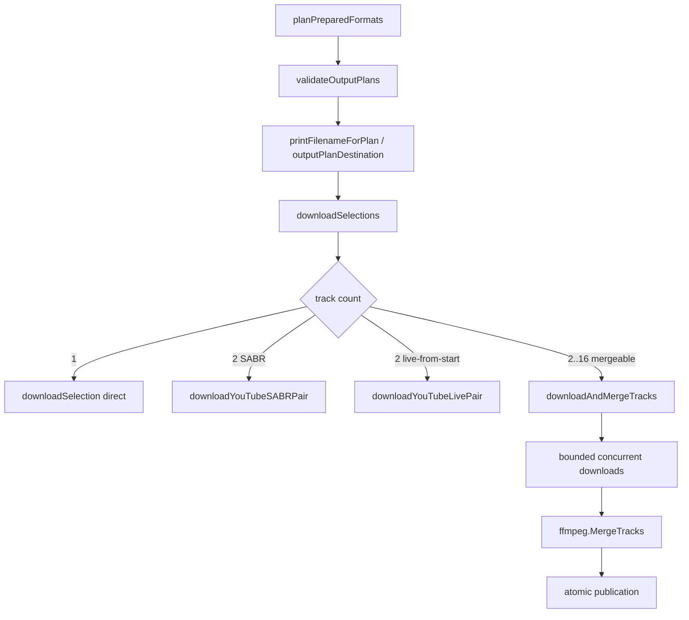

# N-track execution evidence

Reference: yt-dlp commit `aefce1eea4d0b6bab1ec2bd3beff09bff91a39c8`

Branch: `codex/format-ntrack-execution`

Depends on: PR #147 (`codex/format-selector-planner-parity`, merged)

## Architecture

## Extension resolution

Execution consumes planner-owned metadata:

1. **Default:** `plan.Metadata.ext` from PR 5 `planMetadataFor`.
2. **Override:** when `Request.MergeOutputFormat` is set, recompute via
   `format.CompatibleExtensionForSelections` with parsed slash-separated
   preferences (product-layer override until CLI PR 9).
3. **Single-track:** metadata or track `Ext` via `plannedOutputExtension`.

The interim duplicate `get_compatible_ext` implementation in `pkg/ytdlp` was
removed; execution delegates to `internal/format`.

## FFmpeg input and map ordering

Matches pinned `FFmpegMergerPP`:

1. `-i <path>` in `OutputPlan.Tracks` order (= `requested_formats` order).
2. Per input: `-map <i>:a:0` then `-map <i>:v:0` when present.
3. `-c copy` plus HLS AAC `aac_adtstoasc` when required.

HLS AAC fixup is decided from the probed local audio codec, not selected-format
metadata. `MergeTracks` calls `prepareMergeInputs`, which ffprobes each
`m3u8*` audio-bearing input and sets `HLSAACFixup` only when the first actual
audio stream codec is exactly `aac`. `BuildMergeArguments` remains pure and
consumes the prepared flag.

## Concurrency

- Maximum tracks: `format.MaxMergeTracks` (16).
- Download concurrency: 4 workers with semaphore.
- Events serialized through `lockedEventSink`.

## Cancellation and cleanup

- First substantive track failure cancels siblings; the triggering HTTP error is
  preserved rather than replacing it with `context.Canceled`.
- Private workspace `.ytdlp-formats-*` removed on all paths.
- No partial destination publication on failure or cancellation.

## Byte accounting

- Per-track download events report individual track bytes.
- Successful merge `Result.Bytes` equals the published file size.

## Merge-output-format

- `Request.MergeOutputFormat` overrides planner `Metadata.ext` for destination
  extension when explicitly set.
- `ParseMergeOutputFormat` validates request input before extraction or download:
  empty string is valid; otherwise slash-separated lowercase entries from the
  pinned `FFmpegMergerPP.SUPPORTED_EXTS` allowlist (`avi`, `flv`, `mkv`, `mov`,
  `mp4`, `webm`); max 64 bytes and 16 entries; no leading/trailing/doubled
  slashes, whitespace-only components, or control characters.
- Invalid values return `ErrorInvalidInput` via `errInvalidRequestOptions`.
- `Request.PreferFreeFormats` remains planner-owned via `Metadata.ext` only.
- Automatic WebM→MKV promotion for thumbnail embedding occurs only when
  `MergeOutputFormat` is unset; explicit `webm` preserves the requested
  container and thumbnail embedding returns the existing unsupported-container
  media error instead of silently rewriting to MKV.

## Platform verification

Verified locally on darwin/arm64 after review fixes:

- `gofmt` on changed Go files; `git diff --check`; `go mod tidy -diff`
- `go test ./internal/format ./internal/media/ffmpeg ./internal/downloader ./pkg/ytdlp -count=1`
- race tests on ffmpeg, downloader, ytdlp
- 20× `NTrack|MergeTracks|Cancellation|Sibling|Cleanup|MergeOutput|Thumbnail`
- `go vet`, `go run ./cmd/paritycheck`
- `go test ./... -count=1`
- cross-compilation linux/darwin/windows amd64/arm64
- `docker build -f .github/python-free.Dockerfile`

## Remaining gaps

- SABR and YouTube live-from-start remain specialized 2-track paths.
- PR 7 multi-output `Result` semantics and PR 8 postprocessor lifecycle not
  pulled forward.
- CLI `--merge-output-format` exposure remains in PR 9.
